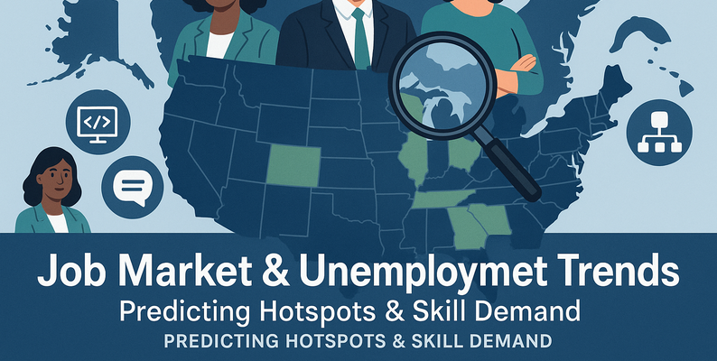

# Introduction

# Backgrouund
Driven by a quest to understand and analyze historical performance and dynamics of the job market and unemployment trends. Leveraging comprehensive job market data, the aim is to pinpoint key metrics impacting employment, identify trends in unemployment rates and job postings, and uncover actionable insights into the labor market behavior. This analysis focuses on daily unemployment rates, job posting volumes, and related indicators such as in-demand skills and demographic information, to maximize understanding of the evolving job market landscape.
# Questions
### 📊 General Overview
1. What are the distinct regions present in the dataset?
2. How many unique states are included in the data?
3. What is the earliest and latest date recorded in the dataset?
4. How many total records are in the dataset?
5. Which state has the highest number of entries in the dataset?
### 📈 Unemployment Rate Analysis
6. What is the average unemployment rate across all states?
7. Which state had the highest unemployment rate in any given month?
8. Which states had an unemployment rate above 10% more than 5 times?
9. What is the average unemployment rate for each region?
10. Which region has the lowest average unemployment rate?
### 📅 Time Series Analysis
11. What is the monthly average unemployment rate across all states?
12. How has the unemployment rate changed over time for a specific state like 'California'?
13. Which month had the overall highest average unemployment rate?
14. What is the trend of unemployment rate in the Southern region over time?
### 📍 State and Region Focus
15. List the top 5 states with the lowest average unemployment rate.
16. Compare the average unemployment rate between 'California' and 'Texas'.
17. Which region had the most volatile unemployment rate (highest standard deviation)?
### 📌 Filtering and Aggregation
18. How many records have an unemployment rate greater than 8%?
19. Find all records where the unemployment rate was below 3%.
20. Which states had an unemployment rate between 4% and 6% for more than 12 months?
# Tools I Used
For my deep dive into the digital advertising strategies, I harnessed the power of several key tools:
- **Pandas:** Essential python library used for data manipulation, analysis, and cleaning.
- **SQL:** The backbone of my analysis, allowing me to query the database and unearth critical insights.
- **MySQL:** The chosen database management system, ideal for handling the job posting data.
- **Visual Studio Code:** My go-to for database management and executing SQL queries.
- **Git & GitHub:** Essential for version control and sharing my SQL scripts and analysis, ensuring collaboration and project tracking.
- **Numpy:** Essential for numerical and scientific computing. It's especially important in data analysis,data science and machine Learning.
# Database Creation
```sql
CREATE SCHEMA jobmarket;
```
# Table Creation
```sql
CREATE TABLE job(
    id INT AUTO_INCREMENT,
    date DATE,
    location VARCHAR(255),
    unemployment_rate FLOAT,
    job_postings INT,
    in_demand_skills LONGTEXT,
    average_age INT,
    college_degree_percentage INT,
    PRIMARY KEY (id)
)
```
# The Analysis
### Which states had an unemployment rate between 4% and 6% for more than 12 months?
```sql
SELECT location,COUNT(*) AS months_in_range
FROM job
WHERE unemployment_rate BETWEEN 4 AND 6
GROUP BY location
HAVING COUNT(*) > 12
ORDER BY months_in_range DESC;
```
### What is the monthly average unemployment rate across all states?
```sql
SELECT 
    DATE_FORMAT(date, '%Y-%m') AS month,
    AVG(unemployment_rate) AS avg_unemployment_rate
FROM job
GROUP BY month
ORDER BY month;
```
### List the top 5 states with the lowest average unemployment rate.
```sql
SELECT location,AVG(unemployment_rate) AS avg_unemployment_rate
FROM job
GROUP BY location
ORDER BY avg_unemployment_rate ASC
LIMIT 5;
```
### Which region has the lowest average unemployment rate?
```sql
SELECT location,AVG(unemployment_rate) AS avg_unemployment_rate
FROM job
GROUP BY location
ORDER BY avg_unemployment_rate ASC
LIMIT 1;
```
The remaining queries are provided below.
[Queries](/queries/)
# What I Learned
Throughout this adventure, I've turbocharged my SQL toolkit with some serious firepower:
- **🧩 Complex Query Crafting:** Mastered the art of advanced SQL, aggregrating data like a pro and wielding WITH clauses for ninja-level temp table maneuvers.
- **📊 Data Aggregation:** Got cozy with GROUP BY and turned aggregate functions like COUNT() and AVG() into my data-summarizing sidekicks.
- **💡 Analytical Wizardry:** Leveled up my real-world puzzle-solving skills, turning questions into actionable, insightful SQL queries.
# Conclusion
This project, by analyzing the job market and unemployment trends data, has provided valuable insights into understanding its historical performance and labor market behavior. The findings from this analysis serve as a guide to identifying key metrics and trends that impact employment. Policy makers, economists, and job seekers can gain a deeper understanding of labor market dynamics by focusing on high-impact indicators like unemployment rates, job posting volumes, and the evolution of in-demand skills. This exploration highlights the importance of continuous data analysis and adaptation to emerging labor market trends to ensure informed decision-making and a deeper understanding of workforce dynamics.
